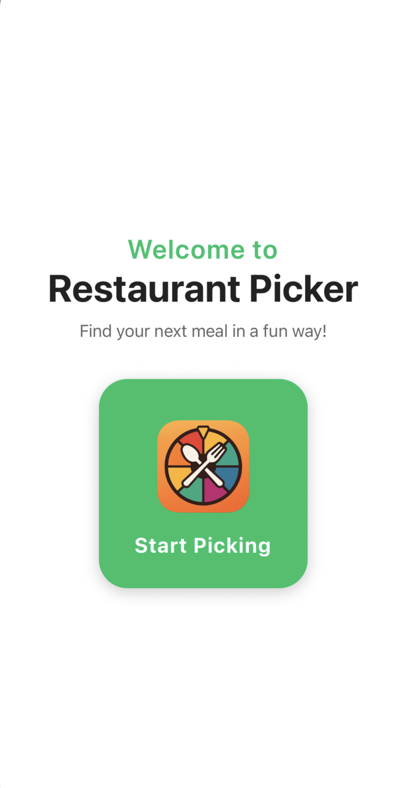

# Restaurant Picker

A cross-platform (iOS & Android) mobile app that helps users decide where to dine by filtering restaurants based on budget, distance, cuisine, diet restrictions, and star rating, then randomly selecting one via an interactive wheel. It currently integrates Google Places & Geocoding, and will soon fetch Instagram, TikTok, and YouTube reels—and use MongoDB for centralized caching of API responses.

---

## Demo Video

<video src="docs/record.mp4" width="560" controls>
  Your browser does not support the video tag.
</video>

---

## Overview

Restaurant Roulette streamlines the decision-making process at mealtime:

1. **Filter** by budget tier, distance (km), cuisine type, diet restrictions, and star rating.  
2. **Choose** your current GPS location or search for a custom address.  
3. **Spin** an interactive wheel loaded with all matching restaurants.  
4. **Select** your pick and view an overview, media reels, and aggregated reviews.  
5. **Reroll** at any time to try another suggestion.

---

## Features

- **Custom Filters**: Budget levels, distance slider, cuisine & dietary restriction checkboxes, star-rating selector.  
- **Location Flexibility**: Use device GPS or enter any address.  
- **Interactive Wheel**: Visually spin to randomly select; remove entries and reroll at will. (Coming Soon)
- **Future Media Integration**: Instagram, TikTok, and YouTube reels for in-app restaurant previews. (Coming Soon)
- **Aggregated Reviews**: Google & Yelp reviews today (Coming Soon)

---

## Tech Stack

### Frontend
- React Native & Expo  
- TypeScript  
- React Navigation  

### Backend & APIs
- Google Places & Geocoding APIs  
- Nominatim (open-source reverse geocoding)  
- YouTube Data API, Instagram Graph API, TikTok for Developers API (Coming Soon)

### Data & Caching
- MongoDB (Coming Soon)
- AsyncStorage (local caching for rapid reloads)  

---